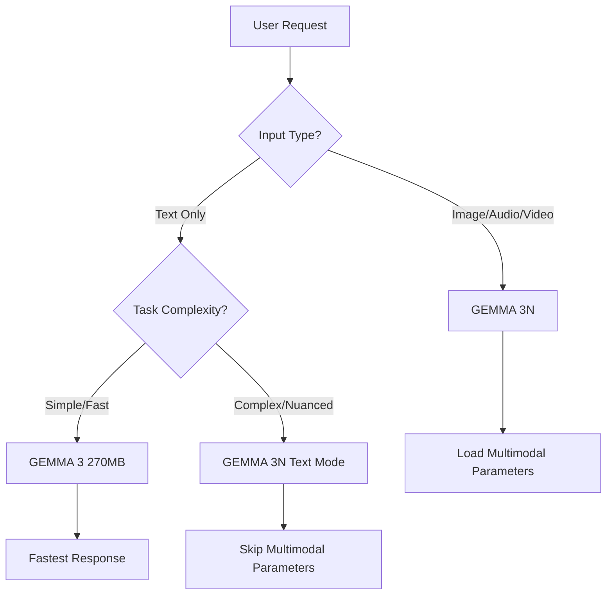

# Product Requirements Document: BrowserGPT
## WebAssembly-Based AI Chat Interface with GEMMA Models

**Version:** 1.0
**Date:** October 22, 2025
**Status:** Initial Draft
**Author:** Product Team

---

## Executive Summary

BrowserGPT is a fully browser-based AI chat interface that leverages WebAssembly (WASM) to run Google's GEMMA family of models entirely client-side. This innovative approach eliminates server dependencies, ensures user privacy, reduces operational costs, and provides offline-capable AI interactions.

### Key Differentiators

- **100% Client-Side Execution**: All AI processing occurs in the user's browser with zero backend dependencies
- **Privacy-First Design**: User data never leaves the device - all conversations remain completely private
- **Dual Model Architecture**: GEMMA 3 270MB for text-only tasks and GEMMA 3N for multimodal (text, image, audio) interactions
- **CloudFlare-Powered CDN**: Models hosted on CloudFlare R2 with zero egress fees and global distribution
- **Offline Capable**: Once models are cached, the application functions without internet connectivity
- **Cost Effective**: No server costs, no API fees, no usage limits

---

## 1. Product Vision & Goals

### 1.1 Vision Statement

Create the most accessible, privacy-focused AI chat interface that runs entirely in the browser, democratizing access to powerful language models without compromising user privacy or requiring expensive infrastructure.

### 1.2 Business Objectives

1. **Accessibility**: Enable anyone with a modern browser to access sophisticated AI capabilities
2. **Privacy Leadership**: Position as the privacy-first alternative to cloud-based AI services
3. **Cost Efficiency**: Eliminate ongoing operational costs associated with model hosting and API calls
4. **Performance**: Deliver sub-second response times for common queries on modern hardware
5. **Developer Adoption**: Provide clear documentation and examples for easy integration

### 1.3 Success Metrics

| Metric | Target | Measurement Period |
|--------|--------|-------------------|
| Initial Load Time | < 5 seconds | Per session |
| Model Download Time (270MB) | < 30 seconds on 10Mbps | Per device |
| First Token Latency | < 500ms | Per query |
| Tokens per Second | > 10 TPS on average hardware | Per query |
| Browser Compatibility | 95%+ modern browsers | Ongoing |
| User Privacy Score | 100% (no data transmission) | Ongoing |

---

## 2. Target Users & Use Cases

### 2.1 Primary User Personas

#### Persona 1: Privacy-Conscious Professional
- **Demographics**: 25-45, tech-savvy, values data privacy
- **Needs**: Private document analysis, sensitive information processing
- **Pain Points**: Distrust of cloud AI services, concerns about data leakage
- **Value Proposition**: Complete data privacy, offline capability

#### Persona 2: Embedded Systems Developer
- **Demographics**: 30-50, software engineers, IoT specialists
- **Needs**: On-device AI for edge computing applications
- **Pain Points**: High latency cloud APIs, network dependencies
- **Value Proposition**: Reference implementation for browser-based AI

#### Persona 3: Students & Researchers
- **Demographics**: 18-35, academic institutions, budget-conscious
- **Needs**: Free AI assistance for learning and research
- **Pain Points**: API costs, usage limits, restricted access
- **Value Proposition**: Unlimited usage, no costs, educational focus

### 2.2 Use Cases

#### Primary Use Cases

1. **Private Document Analysis**
   - User uploads sensitive documents (contracts, medical records)
   - AI analyzes and provides insights without cloud transmission
   - Complete privacy and HIPAA/GDPR compliance potential

2. **Offline AI Assistant**
   - Users in low-connectivity environments (flights, remote areas)
   - Once cached, fully functional without internet
   - Reliable performance regardless of network conditions

3. **Multimodal Content Creation**
   - GEMMA 3N processes images, audio, and text
   - Generate descriptions, transcribe audio, analyze visual content
   - No file uploads to third-party servers

4. **Educational Tool**
   - Students access AI tutoring without subscription fees
   - Schools deploy without infrastructure costs
   - Safe learning environment with no data collection

#### Secondary Use Cases

5. **Developer Prototyping**: Test AI features before committing to cloud infrastructure
6. **Embedded Web Applications**: Add AI to existing web apps without backend changes
7. **Kiosk Systems**: Deploy in public spaces without network dependencies

---

## 3. Model Specifications

### 3.1 GEMMA 3 270MB (Text-Only Model)

**Official Documentation**: https://developers.googleblog.com/en/introducing-gemma-3-270m/

#### Technical Specifications

| Specification | Details |
|--------------|---------|
| **Total Parameters** | 270 million (170M embeddings + 100M transformer) |
| **Vocabulary Size** | 256,000 tokens |
| **Model Size** | 270 MB (unquantized) |
| **Quantized Size** | 240 MB (INT4 with QAT) |
| **Context Window** | 8K tokens |
| **Instruction Following** | IFEval benchmark leader for size class |
| **Languages Supported** | 140+ languages |
| **Specialization** | Fine-tuning for specific tasks |

#### Performance Characteristics

- **Energy Efficiency**: 0.75% battery usage per 25 conversations (Pixel 9 Pro)
- **Inference Speed**: Optimized for on-device deployment
- **Use Cases**:
  - Sentiment analysis
  - Entity extraction
  - Query routing
  - Text classification
  - Structured data generation

#### Available Quantizations

- **BF16** (16-bit): 400 MB - Highest quality
- **SFP8** (8-bit): 297 MB - Balanced performance
- **Q4_0** (4-bit): 240 MB - Maximum efficiency with QAT

### 3.2 GEMMA 3N (Multimodal Model)

**Official Documentation**: https://ai.google.dev/gemma/docs/gemma-3n

#### Technical Specifications

| Specification | Details |
|--------------|---------|
| **Effective Parameters** | E2B (~2B effective), E4B (~4B effective) |
| **Total Parameters** | 5B+ (with parameter skipping: 1.91B) |
| **Context Window** | 32K tokens |
| **Modalities** | Text, Image, Audio, Video |
| **Vision Encoder** | MobileNet-V5 (state-of-the-art) |
| **Languages** | 140+ |
| **Architecture** | MatFormer (Matryoshka Transformer) |

#### Innovative Features

1. **PLE Caching** (Per-Layer Embedding)
   - Parameters cached to local storage
   - Reduces memory footprint by ~60%
   - Enhances layer-by-layer performance

2. **MatFormer Architecture**
   - Nested models within larger model
   - E2B model contained within E4B
   - Selective activation reduces compute costs

3. **Conditional Parameter Loading**
   - Skip audio/visual parameters when not needed
   - Dynamic loading based on task requirements
   - Further memory reduction for text-only tasks

4. **Multimodal Capabilities**
   - Audio: Speech recognition, transcription, audio analysis
   - Vision: Image understanding, OCR, visual QA
   - Text: All standard language model tasks

#### Model Variants

| Variant | Memory (Standard) | Memory (Optimized) | Use Case |
|---------|------------------|-------------------|----------|
| E2B | 5.1 GB | 1.91 GB | General multimodal |
| E4B | 8+ GB | 3.5 GB | Complex multimodal |

### 3.3 Model Selection Strategy



---

## 4. Technical Architecture

### 4.1 High-Level Architecture

```
┌─────────────────────────────────────────────────────────────┐
│                        User Browser                          │
├─────────────────────────────────────────────────────────────┤
│  ┌───────────────────────────────────────────────────────┐  │
│  │              React UI Layer                           │  │
│  │  • Chat Interface                                     │  │
│  │  • Model Selection                                    │  │
│  │  • File Upload (Images/Audio)                         │  │
│  │  • Settings & Configuration                           │  │
│  └───────────────────────────────────────────────────────┘  │
│                          ↓                                   │
│  ┌───────────────────────────────────────────────────────┐  │
│  │         WebAssembly Inference Engine                  │  │
│  │  • Transformers.js (ONNX Runtime Web)                 │  │
│  │  • WebGPU Acceleration                                │  │
│  │  • Multi-threading (Web Workers)                      │  │
│  │  • Memory Management                                  │  │
│  └───────────────────────────────────────────────────────┘  │
│                          ↓                                   │
│  ┌───────────────────────────────────────────────────────┐  │
│  │         Model Loading & Caching Layer                 │  │
│  │  • IndexedDB Model Cache                              │  │
│  │  • Progressive Loading with Progress                  │  │
│  │  • PLE Cache Management                               │  │
│  │  • Conditional Parameter Loading                      │  │
│  └───────────────────────────────────────────────────────┘  │
└─────────────────────────────────────────────────────────────┘
                          ↓
                 (First Load Only)
                          ↓
┌─────────────────────────────────────────────────────────────┐
│              CloudFlare R2 CDN (Global)                      │
├─────────────────────────────────────────────────────────────┤
│  • GEMMA 3 270MB Model Files                                │
│  • GEMMA 3N Model Files (E2B/E4B)                           │
│  • PLE Cache Data                                           │
│  • ONNX Optimized Weights                                   │
│  • Zero Egress Fees                                         │
│  • Global Distribution                                      │
└─────────────────────────────────────────────────────────────┘
```

### 4.2 Technology Stack

#### Frontend Framework
- **React 18+**: Modern UI with concurrent features
- **TypeScript**: Type safety and better developer experience
- **Vite**: Fast build tooling and HMR

#### AI Inference
- **Transformers.js v3**: Primary inference library
  - ONNX Runtime Web backend
  - WebGPU acceleration support
  - Pre-built GEMMA model support
- **ONNX Runtime Web**: Low-level WASM execution
  - WebAssembly SIMD
  - Multi-threading support
  - Optimized memory management

#### Browser APIs
- **WebGPU**: Hardware acceleration for matrix operations
- **Web Workers**: Parallel processing and UI responsiveness
- **IndexedDB**: Model caching and persistent storage
- **Service Workers**: Offline capability and cache management

#### Model Hosting
- **CloudFlare R2**: Object storage for model files
  - S3-compatible API
  - Zero egress fees
  - Global CDN distribution
  - CORS configuration for browser access

### 4.3 Component Architecture

See detailed architecture documentation in: `Docs/02-Architecture/`

---

## 5. CloudFlare Integration

### 5.1 R2 Storage Configuration

Based on research from: https://medium.com/@ernestodotnet/host-your-gemma-3-ai-models-on-cloudflare-r2-a-complete-guide-55ef76c1143c

#### Bucket Structure

```
ai-models/
├── gemma-3/
│   ├── 270mb/
│   │   ├── model.onnx
│   │   ├── model.onnx.data
│   │   └── tokenizer.json
│   └── 270mb-int4/
│       ├── model_quantized.onnx
│       └── tokenizer.json
├── gemma-3n/
│   ├── e2b/
│   │   ├── text/
│   │   │   ├── model.onnx
│   │   │   └── tokenizer.json
│   │   ├── vision/
│   │   │   └── mobilenet_v5.onnx
│   │   ├── audio/
│   │   │   └── audio_encoder.onnx
│   │   └── ple-cache/
│   │       └── embeddings.bin
│   └── e4b/
│       └── [similar structure]
└── metadata/
    └── versions.json
```

#### Access Configuration

1. **Public Access**: Enabled for direct CDN downloads
2. **CORS Policy**:
   ```json
   {
     "AllowedOrigins": ["*"],
     "AllowedMethods": ["GET", "HEAD"],
     "AllowedHeaders": ["*"],
     "MaxAgeSeconds": 86400
   }
   ```
3. **Cache Control**:
   - Models: `max-age=31536000` (1 year, immutable)
   - Metadata: `max-age=3600` (1 hour)

### 5.2 Model URLs

```javascript
const MODEL_BASE_URL = 'https://pub-[your-id].r2.dev';

const MODEL_PATHS = {
  gemma270mb: `${MODEL_BASE_URL}/gemma-3/270mb/model.onnx`,
  gemma270mbInt4: `${MODEL_BASE_URL}/gemma-3/270mb-int4/model_quantized.onnx`,
  gemma3nE2B: `${MODEL_BASE_URL}/gemma-3n/e2b/text/model.onnx`,
  gemma3nE2BVision: `${MODEL_BASE_URL}/gemma-3n/e2b/vision/mobilenet_v5.onnx`,
  gemma3nE2BAudio: `${MODEL_BASE_URL}/gemma-3n/e2b/audio/audio_encoder.onnx`,
  gemma3nPLE: `${MODEL_BASE_URL}/gemma-3n/e2b/ple-cache/embeddings.bin`
};
```

### 5.3 Cost Analysis

| Component | Free Tier | Usage (Est.) | Monthly Cost |
|-----------|-----------|--------------|--------------|
| Storage | 10 GB | 8 GB (models) | $0 |
| Class A Ops | 1M/month | < 100K | $0 |
| Class B Ops | 10M/month | < 1M | $0 |
| Egress | **FREE** | Unlimited | **$0** |
| **Total** | | | **$0** |

**Note**: With S3, egress for 1TB would cost ~$90/month. R2 saves this entirely.

---

## 6. Implementation Plan

### 6.1 Phase 1: Foundation (Weeks 1-2)

**Deliverables**:
- [ ] Project setup with Vite + React + TypeScript
- [ ] CloudFlare R2 bucket created and configured
- [ ] GEMMA 3 270MB model uploaded to R2
- [ ] Basic UI shell with chat interface
- [ ] Model loading infrastructure with progress indicators

**Technical Tasks**:
1. Initialize React project with TypeScript
2. Set up CloudFlare R2 bucket with proper CORS
3. Convert GEMMA 3 270MB to ONNX format
4. Implement progressive model download with caching
5. Create basic chat UI components

### 6.2 Phase 2: Core Inference (Weeks 3-4)

**Deliverables**:
- [ ] Transformers.js integration with GEMMA 3 270MB
- [ ] WebGPU acceleration enabled
- [ ] Web Worker implementation for UI responsiveness
- [ ] IndexedDB caching for models
- [ ] Basic text generation working

**Technical Tasks**:
1. Integrate Transformers.js library
2. Implement model loading from R2
3. Set up Web Workers for inference
4. Add IndexedDB caching layer
5. Implement streaming text generation

### 6.3 Phase 3: Multimodal Support (Weeks 5-7)

**Deliverables**:
- [ ] GEMMA 3N E2B model integrated
- [ ] Image upload and processing
- [ ] Audio input support
- [ ] PLE caching implementation
- [ ] Conditional parameter loading

**Technical Tasks**:
1. Upload GEMMA 3N models to R2
2. Implement multimodal input handling
3. Add vision encoder integration
4. Build audio processing pipeline
5. Optimize memory with PLE caching

### 6.4 Phase 4: Optimization (Weeks 8-9)

**Deliverables**:
- [ ] INT4 quantization models deployed
- [ ] MatFormer dynamic model sizing
- [ ] Service Worker for offline mode
- [ ] Performance benchmarking complete
- [ ] Memory profiling and optimization

**Technical Tasks**:
1. Implement model quantization
2. Add dynamic model selection
3. Build Service Worker for offline
4. Profile and optimize memory usage
5. Benchmark across devices

### 6.5 Phase 5: Polish & Launch (Weeks 10-12)

**Deliverables**:
- [ ] Complete documentation
- [ ] User onboarding flow
- [ ] Error handling and recovery
- [ ] Cross-browser testing
- [ ] Production deployment

**Technical Tasks**:
1. Write comprehensive documentation
2. Build first-time user experience
3. Implement robust error handling
4. Test on all major browsers
5. Deploy to production

---

## 7. User Experience

### 7.1 User Flows

#### First-Time User Flow

```
1. User visits BrowserGPT
   ↓
2. Landing page explains browser-based AI
   ↓
3. User clicks "Start Chat"
   ↓
4. Model selection dialog:
   - "Fast Mode" (270MB, text-only)
   - "Multimodal Mode" (E2B, images/audio)
   ↓
5. Download progress shown (with size/speed)
   ↓
6. Model caches to browser
   ↓
7. Chat interface ready
   - "Your model is ready and private"
   - "All processing happens in your browser"
   ↓
8. User starts chatting
```

#### Returning User Flow

```
1. User visits BrowserGPT
   ↓
2. Cached model detected
   ↓
3. Chat interface loads instantly
   ↓
4. "Welcome back! Your model is ready."
   ↓
5. User starts chatting immediately
```

### 7.2 Interface Design

#### Chat Interface Requirements

1. **Message Display**
   - Clear user/AI message distinction
   - Markdown rendering for formatted text
   - Code syntax highlighting
   - Image/audio display for multimodal inputs

2. **Input Area**
   - Text input with multi-line support
   - File upload button (images/audio)
   - Model selector dropdown
   - Settings gear icon

3. **Status Indicators**
   - Model loaded status
   - Generation progress
   - Tokens per second
   - Memory usage

4. **Settings Panel**
   - Temperature control
   - Max tokens slider
   - Model selection
   - Clear cache option

### 7.3 Accessibility

- **Keyboard Navigation**: Full keyboard support
- **Screen Readers**: ARIA labels and semantic HTML
- **Color Contrast**: WCAG AA compliance
- **Responsive Design**: Mobile-first approach

---

## 8. Performance Requirements

### 8.1 Target Benchmarks

| Metric | Target | Measurement |
|--------|--------|-------------|
| Initial Page Load | < 2s | Time to interactive |
| Model Download (270MB) | < 30s | On 10Mbps connection |
| Model Load to Memory | < 3s | After download complete |
| First Token Latency | < 500ms | User input to first token |
| Throughput | > 10 tokens/sec | Average generation speed |
| Memory Usage | < 2GB | Peak browser memory |
| UI Responsiveness | < 100ms | Input lag during inference |

### 8.2 Optimization Strategies

1. **Model Loading**
   - Progressive download with chunking
   - Parallel loading of model parts
   - Compression during transit

2. **Inference Performance**
   - WebGPU for matrix operations
   - Web Workers for parallel processing
   - WASM SIMD instructions
   - INT4 quantization

3. **Memory Management**
   - PLE caching to IndexedDB
   - Conditional parameter loading
   - Aggressive garbage collection
   - Model eviction policies

4. **Caching Strategy**
   - IndexedDB for model weights
   - Service Worker for offline
   - Browser cache for static assets

---

## 9. Security & Privacy

### 9.1 Privacy Guarantees

1. **Zero Server Communication**
   - All inference happens client-side
   - No telemetry or analytics by default
   - No conversation logging

2. **Data Isolation**
   - All data stays in browser storage
   - No cross-origin requests (except model download)
   - IndexedDB encrypted by browser

3. **User Control**
   - Clear cache functionality
   - Export conversation history (local only)
   - Explicit privacy policy

### 9.2 Security Considerations

1. **Model Integrity**
   - Verify model checksums after download
   - HTTPS-only model delivery
   - Subresource Integrity (SRI) for scripts

2. **XSS Prevention**
   - Sanitize user inputs
   - Content Security Policy (CSP)
   - Safe HTML rendering

3. **Resource Limits**
   - Maximum context length
   - Token generation limits
   - Memory usage caps

---

## 10. Browser Compatibility

### 10.1 Minimum Requirements

| Feature | Requirement | Browser Support |
|---------|------------|-----------------|
| WebAssembly | Required | Chrome 57+, Firefox 52+, Safari 11+ |
| Web Workers | Required | All modern browsers |
| IndexedDB | Required | All modern browsers |
| WebGPU | Recommended | Chrome 113+, Edge 113+ |
| WASM SIMD | Recommended | Chrome 91+, Firefox 89+ |

### 10.2 Fallback Strategy

```
┌─────────────────┐
│  WebGPU Available?  │
└────────┬────────┘
         │
    ┌────▼────┐
    │   YES   │ ──→ [Best Performance]
    └─────────┘
         │
    ┌────▼────┐
    │    NO   │ ──→ Check WASM SIMD
    └────┬────┘
         │
    ┌────▼────┐
│ SIMD Available? │
    └────┬────┘
         │
    ┌────▼────┐
    │   YES   │ ──→ [Good Performance]
    └─────────┘
         │
    ┌────▼────┐
    │    NO   │ ──→ [Basic WASM, Slower]
    └─────────┘
```

### 10.3 Tested Browsers

- Chrome/Edge 113+ (WebGPU support)
- Firefox 115+ (WASM optimizations)
- Safari 16+ (limited WebGPU)
- Mobile browsers (iOS Safari 16+, Chrome Android)

---

## 11. Deployment Strategy

### 11.1 Hosting Options

**Recommended**: Static Site Hosting
- **Netlify**: Free tier, automatic deployments
- **Vercel**: Excellent performance, edge functions
- **CloudFlare Pages**: Zero egress, pairs with R2
- **GitHub Pages**: Free, simple, no build required

### 11.2 Build Configuration

```javascript
// vite.config.ts
export default {
  build: {
    target: 'es2020',
    rollupOptions: {
      output: {
        manualChunks: {
          'transformers': ['@xenova/transformers'],
          'react': ['react', 'react-dom']
        }
      }
    }
  },
  optimizeDeps: {
    exclude: ['@xenova/transformers']
  }
}
```

### 11.3 CI/CD Pipeline

```yaml
# .github/workflows/deploy.yml
name: Deploy BrowserGPT
on: [push]
jobs:
  deploy:
    runs-on: ubuntu-latest
    steps:
      - uses: actions/checkout@v3
      - uses: actions/setup-node@v3
      - run: npm install
      - run: npm run build
      - run: npm run test
      - uses: netlify/actions/cli@master
        with:
          args: deploy --prod
```

---

## 12. Testing Strategy

### 12.1 Test Coverage

1. **Unit Tests**
   - Model loading utilities
   - Caching mechanisms
   - Input sanitization

2. **Integration Tests**
   - End-to-end inference pipeline
   - Multimodal input handling
   - Browser storage management

3. **Performance Tests**
   - Load time benchmarks
   - Inference speed benchmarks
   - Memory usage profiling

4. **Browser Tests**
   - Cross-browser compatibility (Playwright)
   - Mobile device testing
   - Fallback mechanism validation

### 12.2 Quality Gates

- [ ] All unit tests passing
- [ ] Performance benchmarks met
- [ ] Browser compatibility verified
- [ ] Accessibility audit passed (Lighthouse)
- [ ] Security headers configured
- [ ] Privacy policy reviewed

---

## 13. Documentation Requirements

### 13.1 User Documentation

- [ ] Getting Started Guide
- [ ] FAQ
- [ ] Troubleshooting Guide
- [ ] Privacy Policy
- [ ] Browser Compatibility Matrix

### 13.2 Developer Documentation

- [ ] Architecture Overview
- [ ] API Reference
- [ ] Model Integration Guide
- [ ] Performance Optimization Guide
- [ ] Contributing Guidelines

### 13.3 Operational Documentation

- [ ] CloudFlare R2 Setup Guide
- [ ] Model Upload Procedures
- [ ] Deployment Checklist
- [ ] Monitoring and Analytics

---

## 14. Risks & Mitigation

| Risk | Impact | Probability | Mitigation |
|------|--------|-------------|------------|
| Browser compatibility issues | High | Medium | Extensive testing, clear system requirements |
| Model download failures | High | Low | Retry logic, chunked downloads, error messaging |
| Performance on low-end devices | Medium | Medium | Quantized models, progressive enhancement |
| Memory limitations | High | Medium | PLE caching, conditional loading, model eviction |
| WebGPU adoption slow | Medium | Low | Fallback to WASM SIMD, clear performance expectations |
| CloudFlare R2 costs | Low | Low | Within free tier, monitoring dashboard |

---

## 15. Future Enhancements

### 15.1 Short-Term (3-6 months)

- [ ] Fine-tuning support for domain-specific models
- [ ] Multi-turn conversation memory optimization
- [ ] RAG (Retrieval-Augmented Generation) with local documents
- [ ] Voice input/output integration
- [ ] PWA (Progressive Web App) installation

### 15.2 Long-Term (6-12 months)

- [ ] Peer-to-peer model sharing
- [ ] Browser extension version
- [ ] Collaborative chat sessions
- [ ] Model marketplace
- [ ] Advanced multimodal features (video understanding)

---

## 16. Appendices

### 16.1 Glossary

- **WASM**: WebAssembly - Binary instruction format for browser execution
- **ONNX**: Open Neural Network Exchange - ML model format
- **WebGPU**: Browser API for GPU acceleration
- **PLE**: Per-Layer Embedding - GEMMA 3N optimization technique
- **MatFormer**: Matryoshka Transformer - Nested model architecture
- **QAT**: Quantization-Aware Training - Method for efficient model compression
- **R2**: CloudFlare's S3-compatible object storage

### 16.2 References

1. GEMMA 3 270M Announcement: https://developers.googleblog.com/en/introducing-gemma-3-270m/
2. GEMMA 3 Model Overview: https://ai.google.dev/gemma/docs/core
3. GEMMA 3N Documentation: https://ai.google.dev/gemma/docs/gemma-3n
4. Transformers.js Documentation: https://huggingface.co/docs/transformers.js
5. CloudFlare R2 Guide: https://medium.com/@ernestodotnet/host-your-gemma-3-ai-models-on-cloudflare-r2-a-complete-guide-55ef76c1143c
6. ONNX Runtime Web: https://onnxruntime.ai/docs/tutorials/web/
7. WebGPU Specification: https://www.w3.org/TR/webgpu/

### 16.3 Change Log

| Version | Date | Changes | Author |
|---------|------|---------|--------|
| 1.0 | 2025-10-22 | Initial PRD creation | Product Team |

---

**Document Status**: ✅ Ready for Review
**Next Review Date**: 2025-11-01
**Owner**: Product Team
**Stakeholders**: Engineering, Design, DevOps
